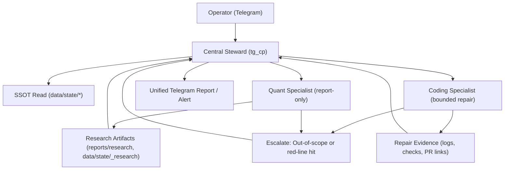

# HONGSTR Agent Organization Governance Spec v1

Last updated: 2026-03-06 (UTC+8)  
Scope: docs-only governance skeleton for a three-agent model, aligned with existing HONGSTR baseline and roadmap red lines.

## 0. Baseline Alignment (Non-Negotiable)

This spec inherits (does not override) these policy SSOTs:

- `docs/skills/global_red_lines.md`
- `docs/slimdown_launchd_planes.md`
- `docs/ops_data_plane.md`
- `docs/obsidian_lancedb.md`

Hard constraints for this spec:

- Do not change `src/hongstr/**` core trading semantics.
- Keep `data/state/*` canonical write ownership on `scripts/state_snapshots.py` via `scripts/refresh_state.sh`.
- Keep Telegram as a single external control/reporting entrance.
- Keep P0 status paths local-first and SSOT-first (no new external API dependency).
- Keep Obsidian/LanceDB as sidecar knowledge layers only.

## 1. Stage Mapping

This governance skeleton maps to roadmap slices as follows:

- Stage 2 (SSOT/state/events/deterministic):
  - single writer boundary remains unchanged
  - event/dispatch/escalation defined as docs-first contracts
- Stage 7 (Telegram single entrance/read-only reporting):
  - central steward remains single Telegram interface
  - no free-form shell execution path is introduced
- Stage 8 (report-only knowledge/research layer):
  - quant specialist stays report-only
  - Obsidian/LanceDB remain non-authoritative sidecar

## 2. Agent Roles, Responsibilities, Boundaries

## 2.1 Central Steward (CEO / Chief Steward)

Role:

- only outward Telegram interface
- 24/7 monitor + summarize + alert + report

Responsibilities:

- read SSOT (`data/state/*`) and approved report artifacts
- unify outputs from quant/coding specialists into a single operator message
- issue escalation notices when specialist output breaches boundary

Boundaries:

- no second writer to `data/state/*`
- no arbitrary shell execution capability
- no direct mutation of trading/runtime semantics

Current repo anchors:

- `_local/telegram_cp/tg_cp_server.py` (single entry command surface: `/status`, `/daily`, `/run`, etc.)
- `_local/telegram_cp/guardrail.py` (action-request refusal / read-only posture)
- `ops/launchagents/com.hongstr.tg_cp.plist` (single Telegram daemon)
- `docs/ops/telegram_operator_manual.md` (single-entry `/daily` contract)

## 2.2 Quant Specialist (Report-Only Research Lead)

Role:

- produce research observations, candidate summaries, governance reports

Responsibilities:

- run report-only research loop and quant skill outputs
- write research artifacts under research/report domains, not production execution state

Boundaries:

- no direct Telegram outbound channel
- no direct execution mutation
- no ownership of canonical SSOT writer

Current repo anchors:

- `research/loop/research_loop.py` (explicit report_only + degrade-to-WARN behavior)
- `ops/launchagents/com.hongstr.research_loop.plist`
- `ops/launchagents/com.hongstr.research_poller.plist`
- `research/loop/specialist_skills_registry.json` (`type: report_only`)
- `docs/ops_research_loop.md`

## 2.3 Coding Specialist (Bounded Repair Specialist)

Role:

- limited-scope operational repair under explicit allowlist

Responsibilities:

- perform bounded fixes in approved path scopes
- escalate immediately on out-of-scope or policy-conflicting requests

Boundaries:

- forbidden to touch `src/hongstr/**` core trading semantics
- forbidden to create a second `data/state/*` writer path
- forbidden to commit local data artifacts
- no free-form commit/push automation; delivery must stay PR-reviewed

Current repo anchors:

- `docs/self_heal.md` (L2 self-heal governance)
- `scripts/self_heal/enforce_allowed_paths.py`
- `scripts/self_heal/run_required_checks.sh`
- `tests/test_self_heal_allowed_paths.py`

## 3. Single Telegram Entrance Model

Routing principle:

- inbound operator messages -> central steward (tg_cp)
- specialist outputs -> artifacts/files -> central steward aggregation -> outbound Telegram message

No-direct-outbound rule:

- quant specialist: no direct Telegram send
- coding specialist: no direct Telegram send

Current integration reference:

- `scripts/notify_telegram.sh` is infrastructure notification utility, not a specialist conversational endpoint
- external conversational interface remains `com.hongstr.tg_cp`

## 4. Event Flow / Dispatch Flow / Escalation Flow

Dispatch contract:

- dispatch is advisory/task-ticket based, not free execution delegation
- every specialist output must include provenance path + timestamp + status

Escalation contract:

- immediate escalate on:
  - core path touch attempt (`src/hongstr/**`)
  - second writer risk (`data/state/*`)
  - unallowlisted repair request
  - uncertainty about red-line compliance

## 5. Repair Class Policy (A / B / Forbidden)

## 5.1 Repair Class A (safe, narrow, docs+ops hygiene)

Allowed examples:

- docs/SOP/checklist/template updates
- launchd template/docs cleanup under `ops/launchagents/` or `docs/ops/`
- `_local/telegram_cp/` non-execution read-only message/schema/template adjustments
- CI/preflight guardrail scripting that does not change core semantics

Gate:

- PR review + guardrail checks only

## 5.2 Repair Class B (bounded script/runtime repair)

Allowed examples:

- allowlisted script path hotfix in `scripts/` + matching tests
- self-heal ticket execution limited by `allowed_paths`
- bounded launchd orchestration hardening (watchdog/restart wrappers) with non-blocking degrade

Gate:

- must include explicit ticket scope (`allowed_paths`)
- must pass required checks in ticket (`must_run`)
- must remain reversible via single commit revert

## 5.3 Forbidden Repair Scope

Forbidden always:

- any core trading semantic change in `src/hongstr/**`
- any new canonical SSOT writer outside `scripts/state_snapshots.py`
- any Telegram path that can execute arbitrary commands
- any repair that introduces mandatory external API dependency into P0 status path

## 6. Data Placement Policy (SSOT vs Obsidian vs LanceDB)

## 6.1 SSOT (`data/state/*`, canonical runtime truth)

Must stay in SSOT:

- `/status` and `/daily` truth payloads (`system_health_latest.json`, `daily_report_latest.json`, etc.)
- canonical health/status snapshots consumed by tg_cp/dashboard
- deterministic state snapshots generated by state plane

Owner boundary:

- `scripts/refresh_state.sh` -> `scripts/state_snapshots.py`
- guarded by `scripts/check_state_writer_boundary.py`

## 6.2 Obsidian (human-readable governance memory)

Suitable:

- incidents, postmortems, runbooks, PM reviews
- daily/strategy/incident markdown from SSOT export
- governance summaries and decision logs

Not suitable:

- canonical status truth for `/status` or `/daily`
- raw data lake replacement

Current anchors:

- `scripts/obsidian_sync.py`
- `docs/obsidian/VAULT_STRUCTURE.md`
- `_local/obsidian_vault/HONGSTR/*`

## 6.3 LanceDB (retrieval memory index)

Suitable:

- chunked retrieval index over Obsidian notes
- similarity recall for incidents/research/SOP context

Not suitable:

- direct status computation source
- canonical metric store for control-plane health

Current anchors:

- `scripts/obsidian_lancedb_index.py`
- `scripts/obsidian_lancedb_query.py`
- `scripts/obsidian_rag_lib.py`
- `_local/lancedb/hongstr_obsidian.lancedb/chunks.json`

## 7. iCloud Mirror Folder Plan (Obsidian)

Target governance folders (design target):

- `Agents/` (agent runbooks, role contracts)
- `Incidents/`
- `Reports/`
- `Skills/`
- `Dashboards/`
- `KB/`

Current implementation gap:

- mirror whitelist currently includes only `KB/` and `Dashboards/`
  - reference: `scripts/obsidian_mirror_publish.sh` (`include_dirs=(KB Dashboards)`)

Migration recommendation:

- Phase 1: keep current whitelist (`KB`, `Dashboards`) to avoid sync blast radius.
- Phase 2: expand whitelist after operator sign-off and mirror volume review.
- Phase 3: add folder-level retention/checklist and mirror health telemetry.

## 8. Skills Governance Principles

Principles:

- policy SSOT for red lines is docs-based (`docs/skills/global_red_lines.md`)
- runtime skills must remain read-only/report-only by contract
- skill deployment cache is not SSOT

Current anchors:

- docs skill source: `docs/skills/*`
- runtime registry:
  - `_local/telegram_cp/skills_registry.json` (read_only)
  - `research/loop/specialist_skills_registry.json` (report_only)
- installer: `scripts/install_hongstr_skills.sh`
- ops guidance: `docs/skills/skills_storage_and_deploy.md`, `docs/ops_skills_cmds.md`

## 9. Degrade / Kill Switch / Removal Plan

## 9.1 Degrade (graceful operation under partial failure)

- central steward:
  - fall back to SSOT short status (`/status`, `/daily` fallback template)
- quant loop:
  - keep `WARN + exit 0` behavior (`research/loop/research_loop.py`, `scripts/run_research_loop.sh`)
- obsidian/lancedb:
  - fallback provider in `scripts/obsidian_rag_run.sh`
  - non-blocking mirror/export wrappers (`scripts/obsidian_mirror_run.sh`)

## 9.2 Kill switch (fast disable)

- disable mirror one-shot: `MIRROR_ENABLED=0 bash scripts/obsidian_mirror_publish.sh`
- disable dashboards export one-shot: `DASHBOARDS_EXPORT_ENABLED=0 bash scripts/obsidian_mirror_run.sh`
- disable optional control-plane notify: `CONTROL_PLANE_REPORT_NOTIFY=0`
- disable launchd jobs:
  - `com.hongstr.obsidian_mirror`
  - `com.hongstr.obsidian_rag`
  - `com.hongstr.kb_sync`
  - `com.hongstr.research_poller`
  - `com.hongstr.research_loop`

## 9.3 Removal plan (rollback path)

- Phase R1: disable launchd schedule
- Phase R2: keep artifacts read-only for forensic retention
- Phase R3: revert by PR (`git revert <commit_sha>`)
- Phase R4: re-bootstrap only mandatory baseline planes (`refresh_state`, `tg_cp`, `dashboard`)

## 10. Repo Asset Inventory (Referenced)

## 10.1 tg_cp / control plane / Telegram

- `_local/telegram_cp/tg_cp_server.py`
- `_local/telegram_cp/guardrail.py`
- `_local/telegram_cp/router.py`
- `docs/ops/telegram_operator_manual.md`
- `ops/launchagents/com.hongstr.tg_cp.plist`
- `scripts/control_plane_run.sh`
- `scripts/control_plane_report.sh`

## 10.2 state snapshots / refresh_state / system_health / daily_report

- `scripts/refresh_state.sh`
- `scripts/state_snapshots.py`
- `scripts/check_state_writer_boundary.py`
- `ops/launchagents/com.hongstr.refresh_state.plist`
- `docs/ops_data_plane.md`
- `docs/ops/daily_report_contract.md`
- `docs/ops/daily_report_single_entry.md`

## 10.3 Obsidian mirror / KB sync / LanceDB indexer

- `scripts/obsidian_sync.py`
- `scripts/obsidian_lancedb_index.py`
- `scripts/obsidian_lancedb_query.py`
- `scripts/obsidian_rag_run.sh`
- `scripts/obsidian_mirror_run.sh`
- `scripts/obsidian_mirror_publish.sh`
- `scripts/kb_sync_run.sh`
- `scripts/kb_sync_github_prs.py`
- `docs/obsidian_lancedb.md`
- `docs/obsidian/VAULT_STRUCTURE.md`
- `docs/kb_sync.md`
- `docs/ops_obsidian_mirror.md`

## 10.4 healthcheck / watchdog / bounded automation

- `scripts/watchdog_status_snapshot.py`
- `scripts/tg_cp_healthcheck.py`
- `docs/tg_cp_watchdog.md`
- `ops/launchagents/com.hongstr.tg_cp_watchdog.plist`
- `scripts/self_heal/enforce_allowed_paths.py`
- `scripts/self_heal/run_required_checks.sh`
- `docs/self_heal.md`

## 10.5 research report output / skills mechanism

- `research/loop/research_loop.py`
- `research/loop/specialist_skills_registry.json`
- `_local/telegram_cp/skills_registry.json`
- `docs/ops_research_loop.md`
- `docs/ops_skills_cmds.md`
- `docs/skills/skills_storage_and_deploy.md`

## 11. Gap / Risk / Migration Notes

Gap-1:

- `src/hongstr/control_plane/allowlist.py` defines command mappings.
- Current runner (`src/hongstr/control_plane/runner.py`) keeps them advisory only.
- Risk: future wiring to auto-exec would violate central steward boundary.
- Migration rule: keep advisory-only unless separate approved governance PR defines bounded executor with independent guardrails.

Gap-2:

- iCloud mirror currently syncs only `KB/` and `Dashboards/`.
- Proposed governance folders (`Agents/Incidents/Reports/Skills`) are not mirrored yet.
- Migration rule: add folder whitelist incrementally with lock/log/retention checks.

Gap-3:

- tg_cp skill set already includes multiple specialist-like outputs.
- Risk: role boundaries can blur if all skills are exposed without governance tags.
- Migration rule: add explicit role metadata (`owner_agent`, `delivery_mode`) in registry docs before expanding capabilities.
