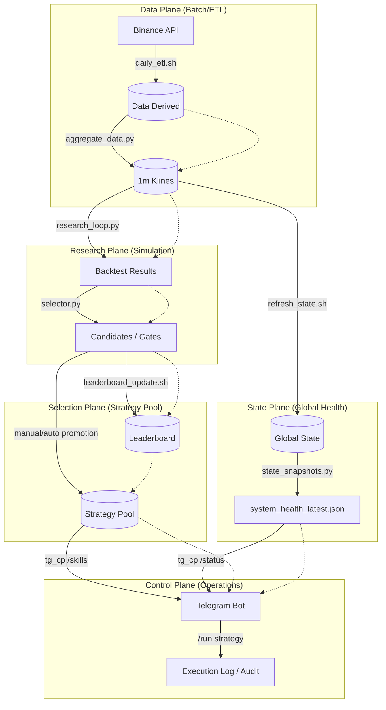

# HONGSTR Closed-Loop Strategy Flow

The HONGSTR lifecycle is a closed-loop system where market data drives research, research produces artifacts, artifacts are promoted to a pool, and the pool is governed by a control plane.

## High-Level Flow

## System Planes

### 1. Data Plane

- **Role**: Collects raw market data and transforms it into canonical derived formats (JSONL/Parquet).
- **Files**: `data/derived/SYMBOL/1m/*.jsonl`

### 2. Research Plane

- **Role**: Simulates strategies across historical data to identify alpha. Generates performance and risk artifacts.
- **Files**: `data/backtests/*/*/*.json`

### 3. State Plane

- **Role**: Monitors the health and "freshness" of the entire repository. Ensures SSOT (Single Source of Truth) consistency.
- **Files**: `data/state/system_health_latest.json`

### 4. Selection Plane

- **Role**: Manages the "Shelf" of active strategies. Ranks candidates and handlespromotion/demotion.
- **Files**: `data/state/strategy_pool.json`, `data/state/_research/leaderboard.json`

### 5. Control Plane

- **Role**: The human/agent interface for real-time monitoring and on-demand audits.
- **Files**: `_local/telegram_cp/tg_cp_server.py`

---
*Red Line Policy: core diff=0 | report_only | no-exec*
