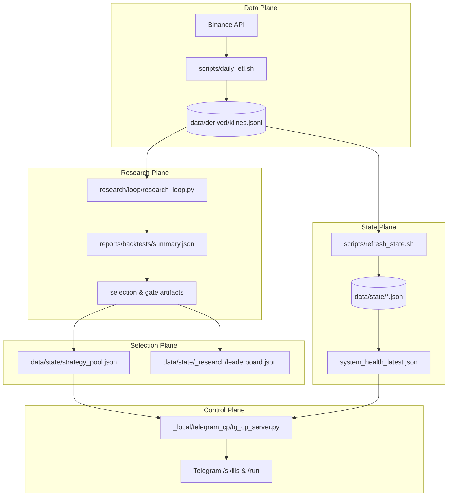

# HONGSTR Flow & Glossary

## 1. System Flow

## 2. Glossary

- **Backtest**: Simulation of a strategy on historical data.
- **Artifacts**: JSON files containing results (summary.json), metadata (selection.json), and governance checks (gate.json).
- **Strategy Pool**: The "Shelf" of strategies currently eligible for tracking or execution.
- **Leaderboard**: A ranked list of candidate strategies based on research loop results.
- **DoD (Definition of Done)**: Mandatory requirements (DoD-1 to DoD-4) for research completion.
- **Gates (G0-G6)**: Progressive compliance hurdles for strategy promotion.
- **SSOT (Single Source of Truth)**: The canonical state stored in files (like system_health_latest.json) that all tools must read.

*For operating model details and multi-agent roles, see [HONGSTR Agent Roster / Role Contracts v1](./hongstr_agent_roster_role_contracts_v1.md).*
