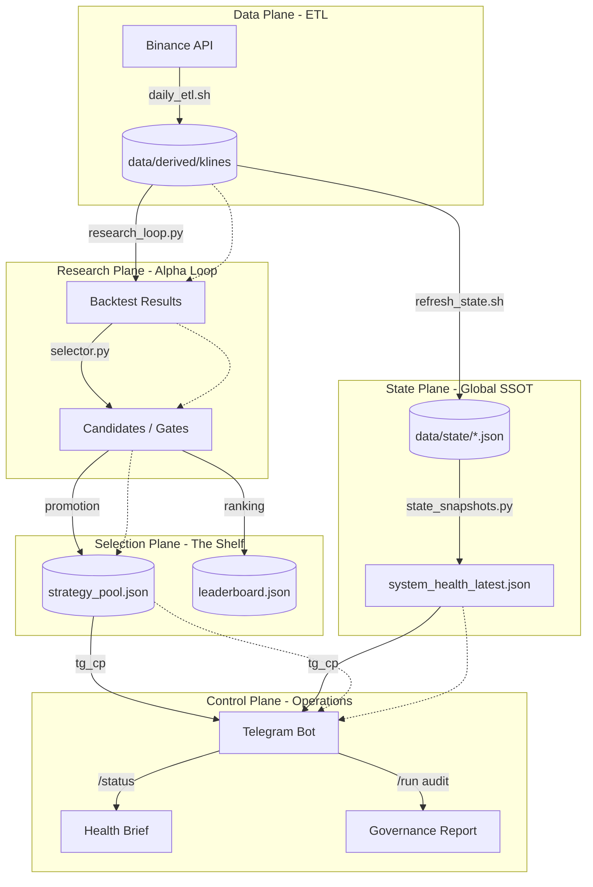

# HONGSTR Lifecycle Flow & Glossary (SSOT)

This document is the Single Source of Truth for understanding the end-to-end HONGSTR strategy lifecycle and the terminology used across the system.

## 1. Strategy Lifecycle Flow

## 2. Terminology Glossary

### Research & Simulation

- **Backtest**: A historical simulation of a strategy to validate its performance characteristics.
- **Backtest ID**: A unique identifier (e.g., `20260227_090000_f431`) for a specific execution of the research loop.
- **Artifacts**: The JSON output of a backtest, including `summary.json` (PnL), `selection.json` (Params), and `gate.json` (Compliance).

### State & Governance

- **SSOT (Single Source of Truth)**: The concept that all system components must read from canonical JSON state files in `data/state/`.
- **System Health**: The aggregate status of data freshness, coverage, and safety brakes.
- **DoD (Definition of Done)**: The set of mandatory research requirements (reproducibility, zero leakage, etc.) before a strategy is "Done".
- **Gates (G0-G6)**: The sequential compliance hurdles a candidate must pass (from sandbox research to production candidate).

### Strategy Management

- **Strategy Pool**: The active "Shelf" of strategies monitored by the Control Plane.
- **Leaderboard**: A meritocratic ranking of potential future candidates updated periodically from the research plane.

### Control & Execution

- **Control Plane**: The Telegram bot interface (`tg_cp`) used for human-in-the-loop monitoring.
- **Skills**: Modular plugins in the Telegram bot for specific tasks (e.g., `status_overview`, `signal_leakage_and_lookahead_audit`).
- **Report-Only**: A governance mode where system outputs are for audit/review only and do not automatically execute trades.

---
*Safety Statement: core diff=0 | report_only | docs-only*
