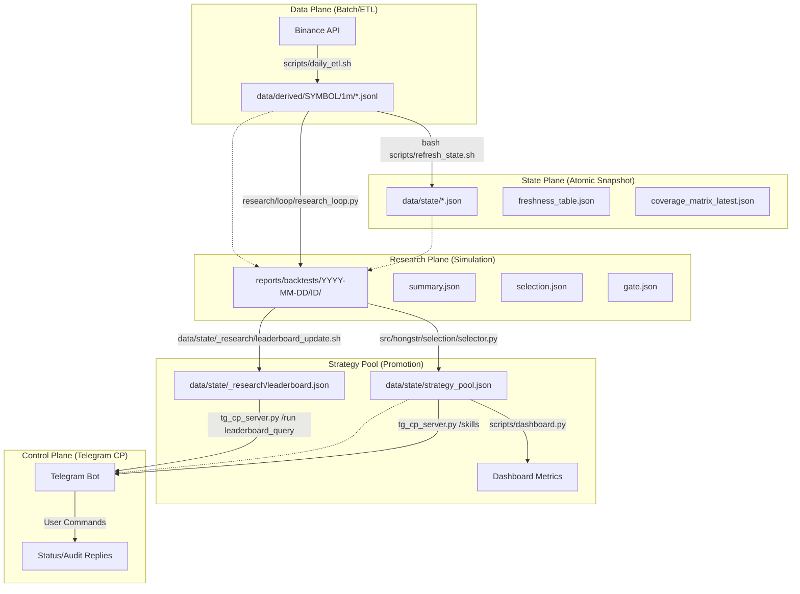

# HONGSTR Strategy Lifecycle Flow

This document describes the end-to-end data and decision flow from raw market data ingestion to strategy control.

## Flow Diagram

## Key Components

- **Data Plane**: Canonical source of truth for backtesting and signal generation.
- **Research Plane**: Where candidate strategies are simulated and artifacts (DoD/Gate) are produced.
- **State Plane**: Global system health and data availability monitors.
- **Strategy Pool**: The active "Shelf" of strategies authorized for monitoring or execution.
- **Control Plane**: Human-in-the-loop audit and management interface via Telegram.

---
*Red Line Policy: core diff=0 | report_only | tg_cp no-exec | data/**gitignored*
