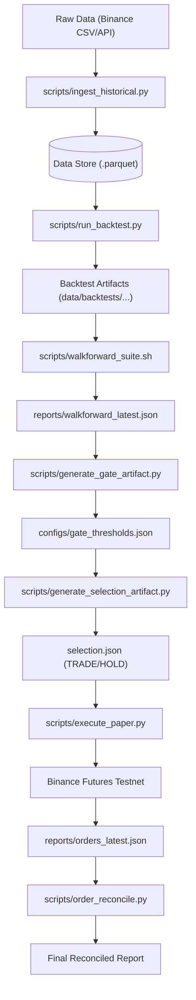

# 🌐 System Overview: The Lifecycle of a Trade

This document outlines the end-to-end flow of the HONGSTR system, from historical data ingestion to post-trade reconciliation.

---

## 🔄 High-Level Data Flow

---

## 🏗️ Core Components

### 1. Backtest Engine (`src/hongstr/backtest/`)

- **Deterministic**: Uses fixed seeds and historical tick/candle data.
- **Fill Logic**: Executes at "Next Open" to prevent lookahead bias.
- **Reporting**: Generates PnL, Sharpe, MDD, and trade logs.

### 2. Analysis & Gating (`src/hongstr/regime/`, `src/hongstr/selection/`)

- **Regime Detection**: Decategorizes market conditions (BULL, BEAR, NEUTRAL).
- **Quality Gate**: Filters strategies based on historical stability (Stability Sharpe).
- **Selection**: Final decision logic that converts backtest performance into a binary `TRADE` or `HOLD` signal.

### 3. Execution Layer (`src/hongstr/execution/`)

- **Bridge**: Interfaces between internal models and external brokers.
- **Binance Futures Testnet**: Custom broker for paper trading with hardened signing.
- **Paper Broker**: Local-only dry-run simulation.

### 4. Verification & Diagnostics (`scripts/`)

- **Walkforward Suite**: Runs recursive out-of-sample tests to prevent overfitting.
- **Action Items**: Analyzes failures and provides code-level fix suggestions.
- **Redirection**: Ensures signature safety via URL-only requests.

---

## 📂 Run Directory Strategy

The system uses timestamped directories for every backtest run:  
`data/backtests/YYYY-MM-DD/HHMMSS_UUID/`

Each directory is **Self-Contained** and contains:

- `selection.json`: The decision at that point in time.
- `trades.parquet`: The raw trade log.
- `equity_curve.parquet`: The performance data.
- `config.json`: The parameters used for the run.
