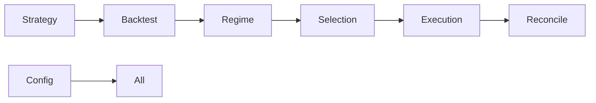

# 🗺️ Repository Map: Ownership & Guardrails

This document maps the physical file structure to functional ownership and safety levels.

---

## 📂 Directory Breakdown

### 🏗️ `/src/hongstr/` (The Core Engine)

| Path | Ownership | Stability | Guardrails |
| :--- | :--- | :--- | :--- |
| `backtest/` | Core Engine | **HIGH** | 🛑 **Protected**: Do not change fill logic. |
| `execution/` | Trade Transport | **MEDIUM** | 🛑 **Protected**: Signing logic is delicate. |
| `regime/` | Market Analysis | **LOW** | 🛠️ **Malleable**: Experiment with detection. |
| `selection/` | Decision Logic | **MEDIUM** | ⚠️ **Sensitive**: Affects TRADE/HOLD signals. |
| `strategy/` | Alpha Logic | **LOW** | 🛠️ **Open**: Add new strategies here. |

### 📜 `/scripts/` (The Interface)

| Script | Purpose | Criticality |
| :--- | :--- | :--- |
| `run_backtest.py` | Run single simulation | High |
| `walkforward_suite.sh` | Performance verification | High |
| `execute_paper.py` | Order execution (Testnet) | **Critical** |
| `generate_action_items.py` | Fault diagnosis | Medium |

### 📊 `/reports/` (The Output)

- `walkforward_latest.json`: The current health of the system across windows.
- `action_items_latest.json`: Current prioritized list of "How to fix the alpha".
- `orders_latest.json`: Tracking for the most recent execution attempt.

---

## 🛡️ Protected Areas (Do Not Touch List)

Codex should avoid modifying these unless completing a specific task with unit test backup:

1. **`src/hongstr/execution/binance_utils.py`**
    - *Risk*: Breaking the HMAC signature or leaking secrets.
2. **`src/hongstr/backtest/engine.py`**
    - *Risk*: Introducing "Lookahead Bias" or breaking determinism.
3. **`pyproject.toml`**
    - *Risk*: Breaking dependency isolation or ruff linting rules.

---

## 🔄 Module Dependencies

